# Atelier REST n°1 – Mise en place d'un service web RESTful

**Étudiant :** Rayen Hamrouni  **Classe :** 3A23  **Matière :** Architecture Orientée Services (SOA) – Esprit

## 1. Objectif
Exposer sous forme d'API REST (JAX-RS / Jersey 2.27, Tomcat 9.0.75, Java 17) la gestion des **options** et des **étudiants** à partir des classes métier fournies (données en mémoire).

URL de base : `http://localhost:8080/Gestion_Options_Etudiants/rest/options`

## 2. Travail réalisé
| Fichier | Rôle |
|---|---|
| `utilities/RestActivator.java` | Active JAX-RS avec `@ApplicationPath("rest")` |
| `ressources/OptionResource.java` | Ressource `/options` (A.1 à A.6) |
| `ressources/EtudiantResource.java` | Ressource `/etudiants` (B.1 à B.6) |
| `utilities/JacksonConfig.java` | Garde le champ `option` dans le JSON malgré `@XmlTransient` |

### Corrections apportées au projet fourni
1. **Données réinitialisées à chaque requête** : les constructeurs de `OptionBusiness` et `EtudiantBusiness` recréaient les listes statiques à chaque `new`. Ajout d'un test (`if (liste != null) return;`) pour n'initialiser qu'une seule fois.
2. **Champ `option` absent du JSON** : `Etudiant.getOption()` est `@XmlTransient` (utile pour le XML de B.6) et Jackson respectait cette annotation. `JacksonConfig` fournit un `ObjectMapper` qui l'ignore : l'option reste dans le JSON, et absente du XML.

## 3. Tests (captures d'écran)

### A. Ressource Option
**A.1 – POST /options** → 200
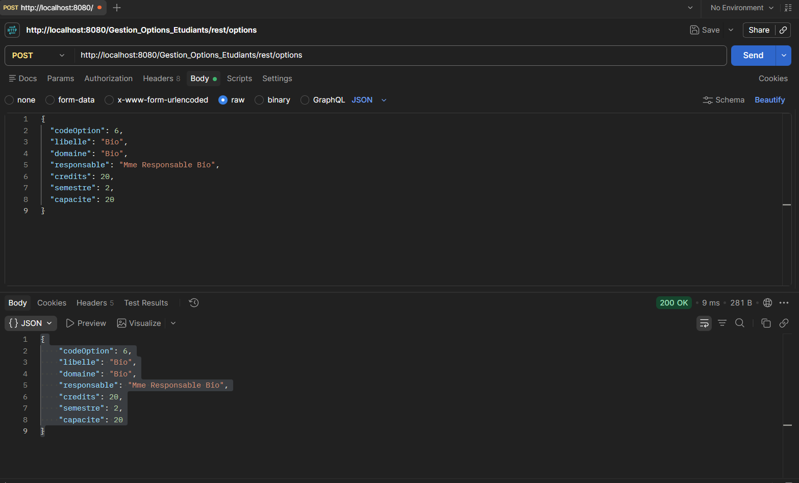

**A.2 – GET /options** → 200
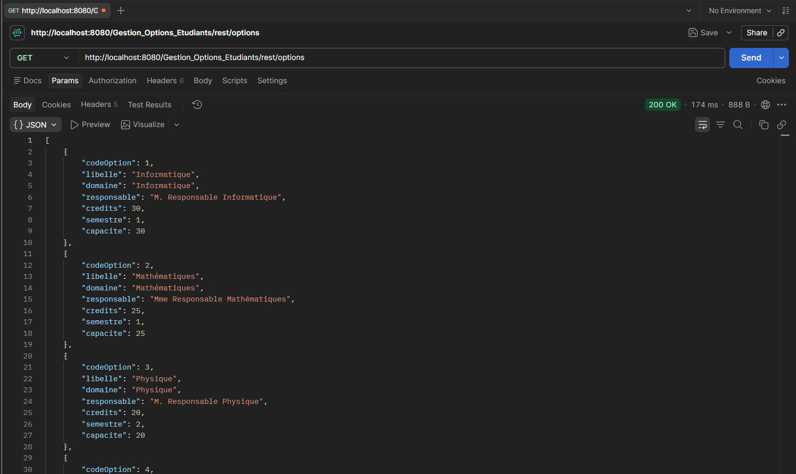

**A.3 – GET /options?domaine=Mathématiques** → 200
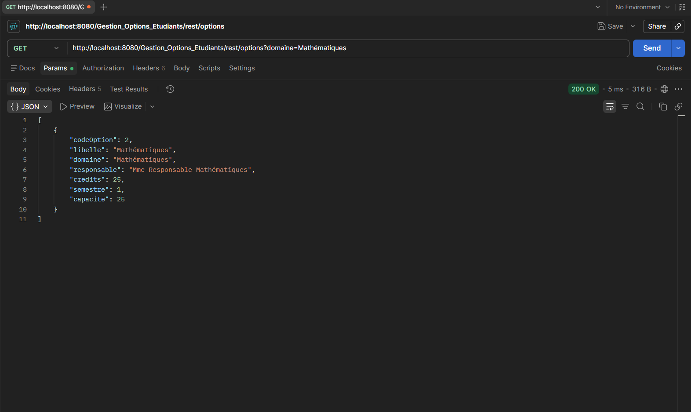

**A.4 – DELETE /options/2** → 204
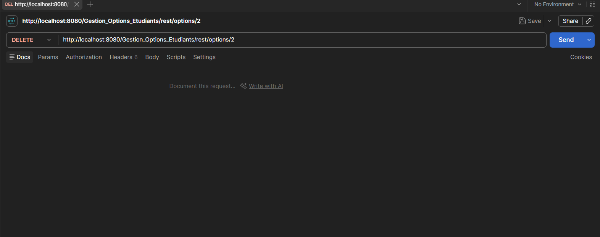

**A.5 – PUT /options/1** → 200
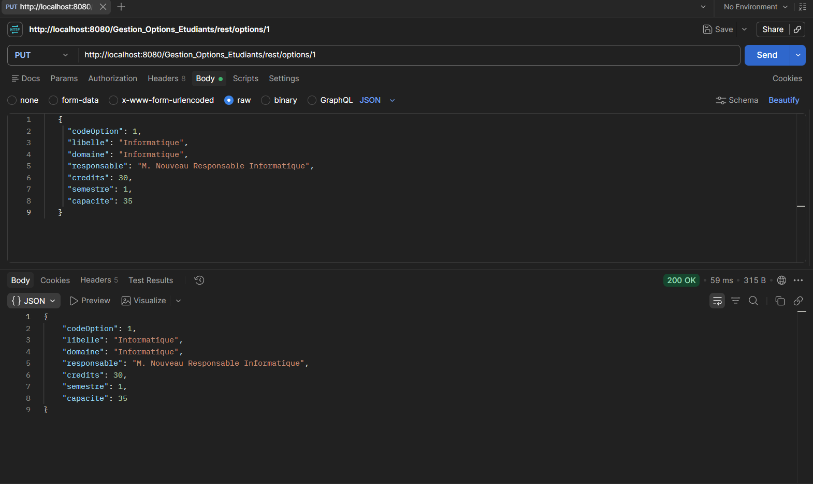

**A.6 – GET /options/1** → 200
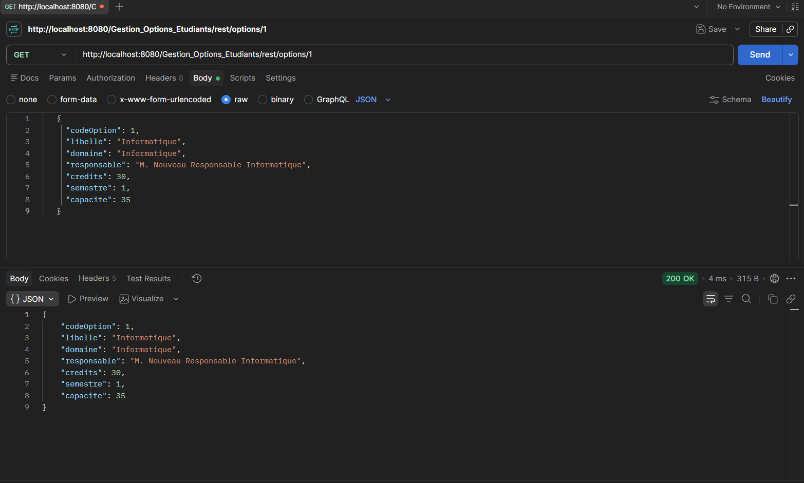

### B. Ressource Etudiant
**B.1 – POST /etudiants** → 200
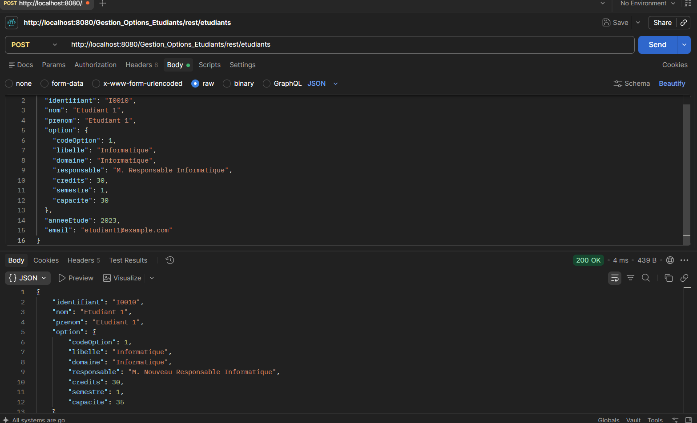

**B.2 – GET /etudiants** → 200
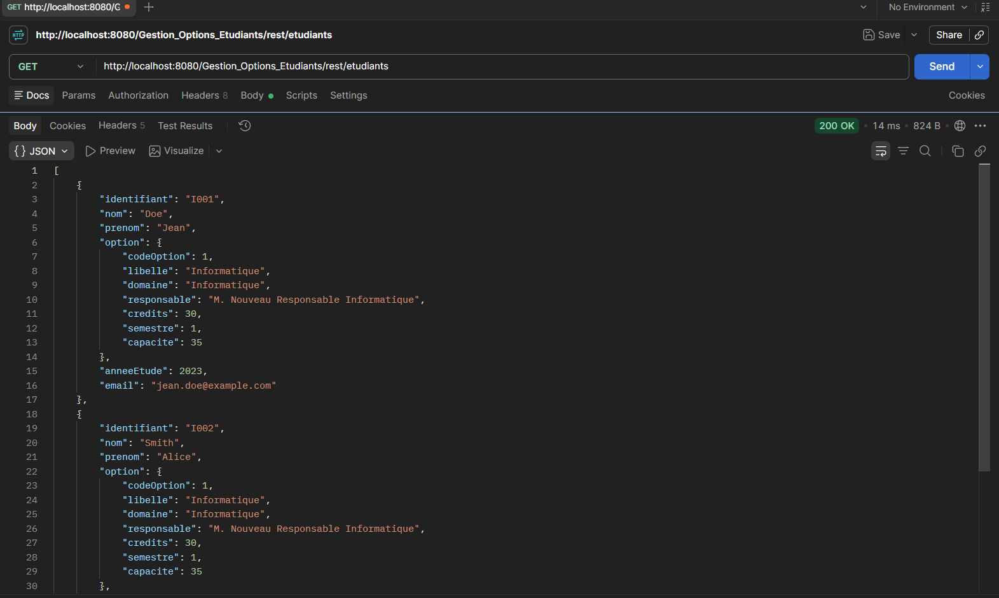

**B.3 – GET /etudiants/I003** → 200
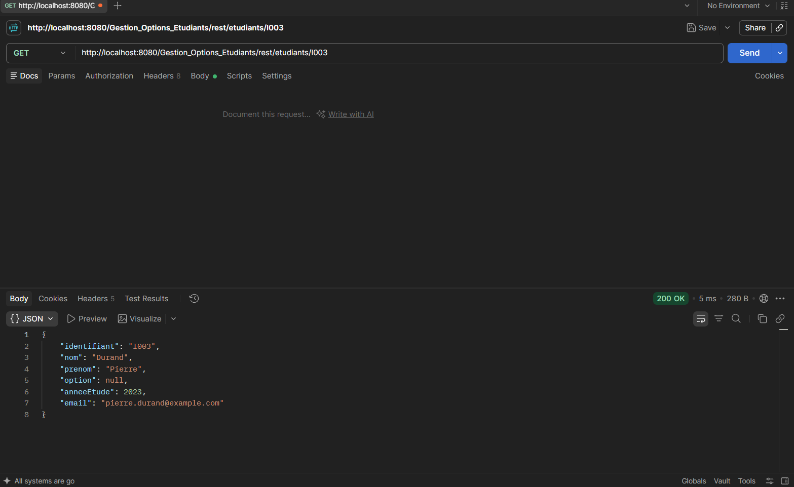

**B.4 – DELETE /etudiants/I003** → 204
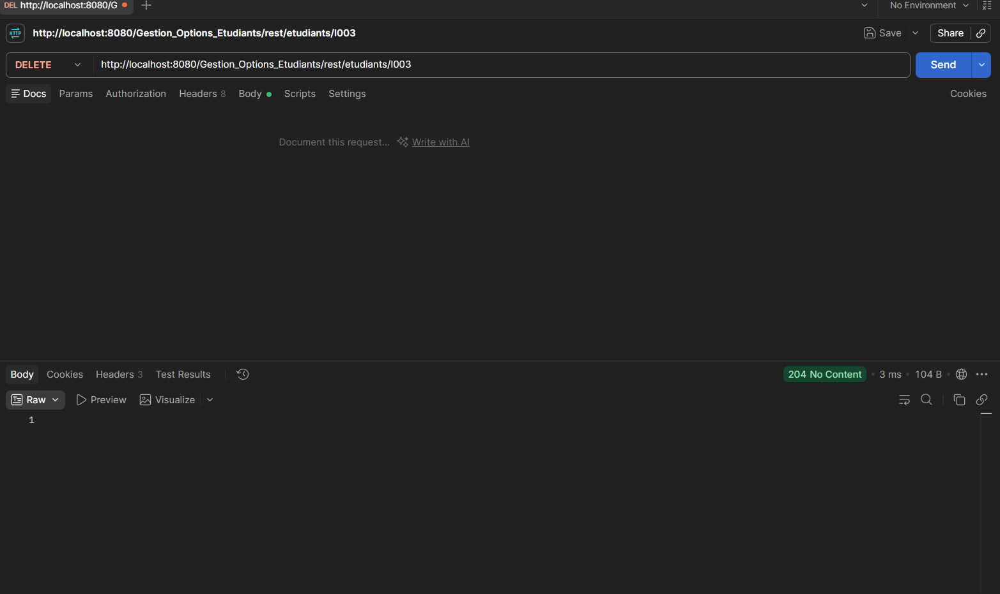

**B.5 – PUT /etudiants/I001** → 200
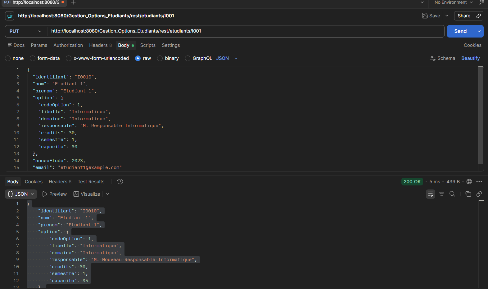

**B.6 – GET /etudiants/option?codeOption=1** → 200 (XML)
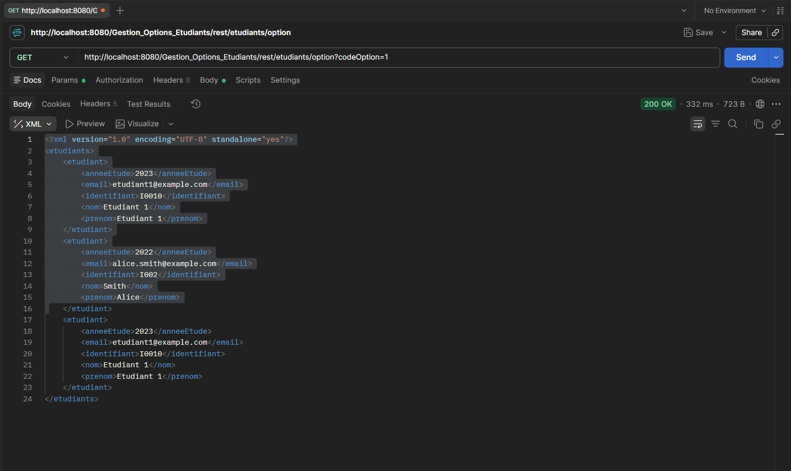

### Cas d'erreur (404)
**GET /options/99** → 404
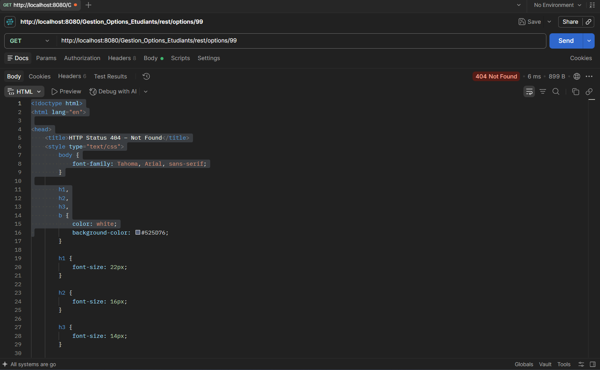

## 4. Lancer le projet
1. Ouvrir le projet dans IntelliJ (Maven) et vérifier la compilation.
2. Configurer Tomcat 9.0.75 (*Run → Edit Configurations → Tomcat Server → Local*).
3. Déployer l'artifact `Gestion_Options_Etudiants:war exploded`, puis lancer.
